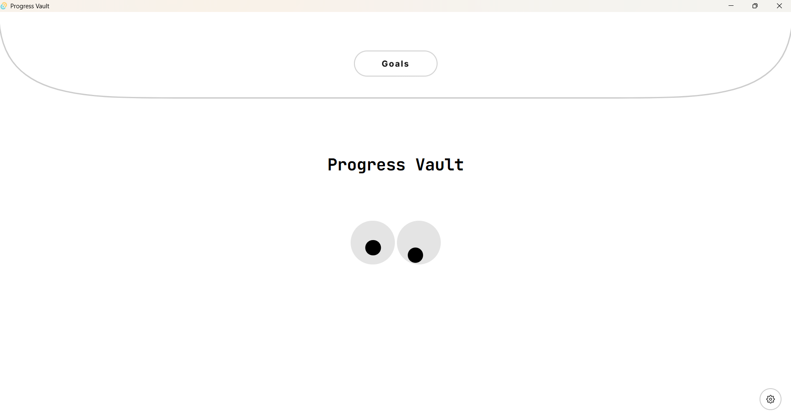
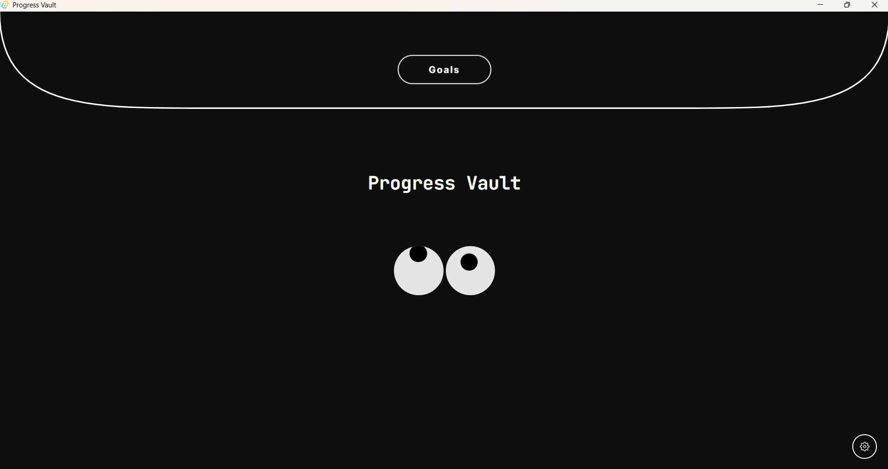
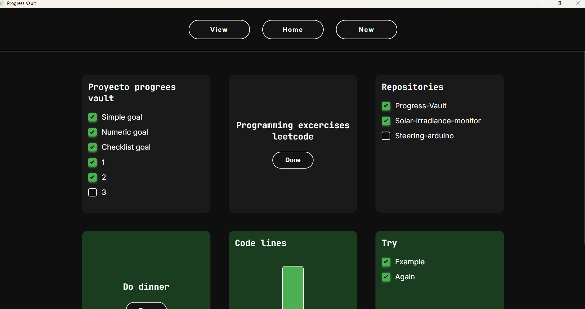
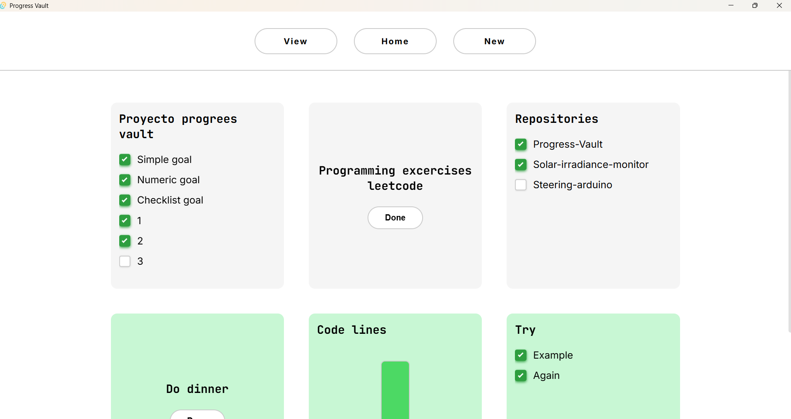
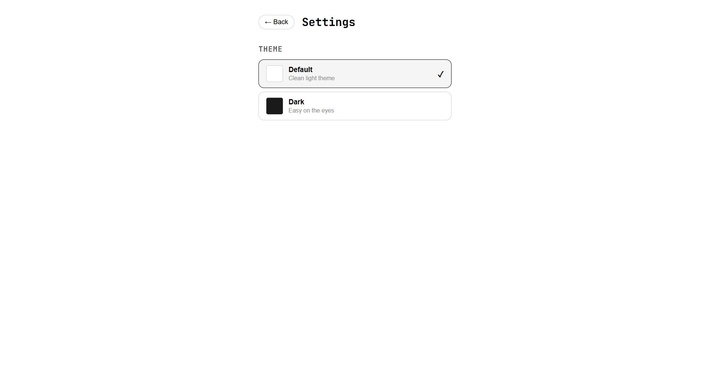

# Progress Vault

> A local-first personal goal tracker — minimal, fast, and fully yours.


 

---

## What is Progress Vault?

Progress Vault is a desktop app built for people who want to track personal goals without noise, subscriptions, or data leaving their machine. No cloud sync. No accounts. Just a clean, opinionated interface that gets out of your way.

Your data lives in a single `data.json` file on your computer — human-readable, editable by hand if you ever need it.

---

## Screenshots



 

 

 

---

## Features

**Three goal types, each with its own character:**

- **Simple** — A binary objective. Mark it done when you're ready. The card turns green.
- **Numeric** — Set a target, increment toward it. A vertical fill bar tracks your progress at a glance.
- **Checklist** — Break a goal into sub-tasks. Add or remove tasks anytime, even after creation.

**Dashboard**
- Sort by newest, oldest, or type
- Filter by completion status or goal type
- Completed goals automatically sink to the bottom of the list
- Smooth card animations when goals reorder or appear

**Themes**
- Light and dark themes out of the box, with more planned
- Theme is persisted across sessions — open the app and it remembers your preference
- Built on CSS custom properties: adding new themes is a matter of overriding a few variables

**Welcome screen**
- Envelope-flap design with an animated transition to your goals
- Interactive eyes that follow your cursor (yes, really)

---

## Tech Stack

| Layer | Technology |
|---|---|
| Desktop shell | [Tauri 2](https://tauri.app/) |
| Backend | Rust |
| Frontend | SvelteKit + Svelte 5 (SPA mode) |
| Storage | JSON file persistence (`data.json`) |
| Styling | CSS custom properties (no external UI framework) |
| Typography | Inter (body) + JetBrains Mono (headings) |

**Architecture:** strict 3-layer separation — Commands / Models / Storage. The frontend never touches the file system directly; everything goes through Tauri commands.

---

## Project Structure

```
progress-vault/
├── src-tauri/                  ← Rust backend
│   └── src/
│       ├── commands/           ← Tauri command handlers
│       ├── models/             ← Goal, SubTask, Config structs
│       └── storage/            ← data.json + config.json read/write
│
├── src/                        ← Svelte frontend
│   ├── components/             ← GoalCard, GoalDetail, WelcomeScreen, EyePair...
│   ├── lib/
│   │   ├── api.js              ← Tauri invoke wrappers
│   │   ├── themes.js           ← Theme definitions + applyTheme()
│   │   └── dashboardPrefs.js   ← Sort/filter logic
│   └── routes/
│       └── +page.svelte        ← App shell + view routing
│
└── README.md
```

---

## Getting Started

### Prerequisites

- [Node.js](https://nodejs.org/) (v18 or later)
- [Rust](https://www.rust-lang.org/tools/install) (stable, `x86_64-pc-windows-msvc` toolchain on Windows)
- [Tauri CLI prerequisites](https://tauri.app/start/prerequisites/) for your OS

### Run in development

```bash
git clone https://github.com/FelipeBeltranING/progress-vault.git
cd progress-vault
npm install
npm run tauri dev
```

### Build for production

```bash
npm run tauri build
```

The installer will be output to `src-tauri/target/release/bundle/`.

---

## Data & Privacy

All data is stored locally in your OS app data directory:

- **Windows:** `%APPDATA%\com.david.progress-vault\`
- **macOS:** `~/Library/Application Support/com.david.progress-vault/`
- **Linux:** `~/.local/share/com.david.progress-vault/`

Two files are created:
- `data.json` — your goals, pretty-printed and human-readable
- `config.json` — your preferences (currently: selected theme)

Neither file is ever sent anywhere. There is no telemetry, no analytics, no network requests from the app itself.

---

## Roadmap

| Iteration | Status | Highlights |
|---|---|---|
| Iteration 1 | ✅ `v0.1` | Core CRUD — create, view, edit, delete goals |
| Iteration 2 | ✅ `v0.2.0` | Sub-tasks, themes, welcome screen, progress bars, animations |
| Iteration 3 | 🔜 Planned | Drag-and-drop reordering, mascot customization, more themes |

---

## Development Philosophy

Progress Vault is built iteratively — each iteration delivers a closed set of requirements before the next begins. The codebase prioritizes:

- **Local-first:** your data is yours, always accessible, never dependent on a server
- **Minimal dependencies:** no UI framework, no state management library, no ORM
- **Readable code:** plain JavaScript (JSDoc annotated), Rust with strict layer separation
- **Extensibility:** themes as CSS variable objects, goal types as Rust enums — both easy to extend

---

## License

MIT — do whatever you want with it.

---

*Built by David Beltran*
